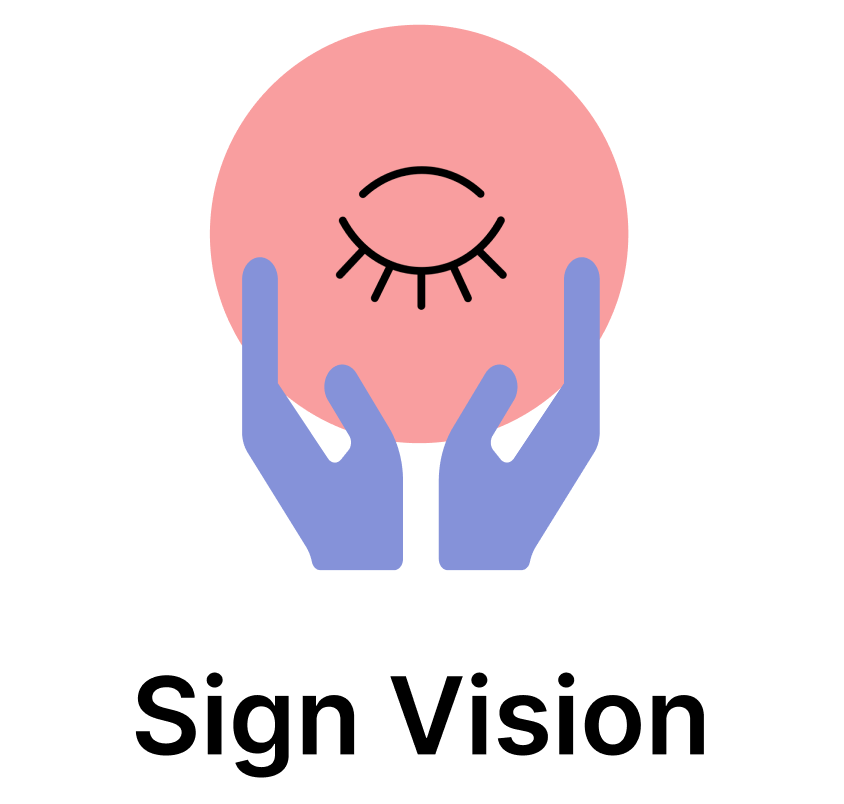

 

   

### Inspiration
This past year with the pandemic has been immensely challenging for everyone. With classes, meetings and many services becoming virtual, communication has proven to be a key aspect in staying updated and connected with friends, family and everyday events. 
Specifically, communication has never been more crucial to those with disabilities. With the enforced usage of masks, it is inconvenient and hard to read other people's lips or even hear speech.

That's why we created Sign Vision.

### About
Sign vision is an android app that improves communication and accessibility at local businesses and services. 
Through Sign Vision, users can record someone performing sign language through their phone while receiving a text translation in real time. In contrast, users may also speak to the phone and will also receive a sign language interpretation of their speech. Finally, if one were to type their text into Sign Vision, they would also receive a sign language translation.

### Technologies
- Java & XML in Android Studio
- Google API
- TensorFlow
